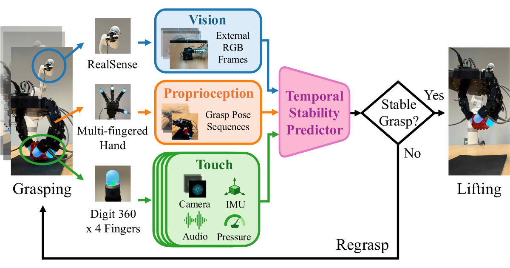

# Temporal Visuo-Tactile Learning for Dexterous Grasp Stability

Ken Nakahara, Aleksei Buvailik, Prokhor Kotov, and Roberto Calandra  
LASR Lab, TU Dresden, Germany

[Project Page](https://lasr-lab.github.io/dexterous-grasp-stability/) · [Paper](https://arxiv.org/abs/2610.10283) · [Dataset](https://doi.org/10.25532/OPARA-1588) · [YouTube](https://www.youtube.com/watch?v=9b29rSzqaKw)



Stable grasping with a multi-fingered hand depends on how contacts form and evolve as the fingers close
around an object. We train temporal multimodal models to predict post-lift grasp stability from pre-lift
vision, proprioception, and fingertip touch, and deploy the predictor on the robot as an online gate that
lifts when confidence is high and regrasps otherwise.

- **Dataset** — Multimodal recordings of 10,000 multi-fingered grasp trials across 200 diverse objects, collected with a
  7-DoF xArm7, a four-fingered 16-DoF Tilburg Hand carrying a Digit 360 sensor on each fingertip, and an
  external RealSense D435i.
- **Offline Evaluation** — A systematic study of grasp stability prediction from pre-lift vision,
  proprioception, and touch. Modality and encoding comparisons, together with controlled analyses of
  tactile spatial resolution and temporal observations, show that high-resolution, dynamic touch provides
  a particularly strong stability signal.
- **Online Deployment** — In real-robot experiments on 20 unseen objects, the tactile stability gate achieves
  82.0% success among executed lifts, 10.5 percentage points above a non-tactile gate.

## Repository Contents

- [`src/`](src/) — scripts for visualizing grasp trials and resampling multimodal recordings, with the dataset
  download instructions. Start here: [`src/README.md`](src/README.md).
- [`docs/`](docs/) — source for the project page. See [`docs/README.md`](docs/README.md).

The dataset is available on [OPARA](https://doi.org/10.25532/OPARA-1588) and is not part of this repository.

## Citation

```bibtex
@misc{nakahara2026temporal,
  title         = {Temporal Visuo-Tactile Learning for Dexterous Grasp Stability},
  author        = {Nakahara, Ken and Buvailik, Aleksei and
                   Kotov, Prokhor and Calandra, Roberto},
  year          = {2026},
  eprint        = {2610.10283},
  archivePrefix = {arXiv},
  primaryClass  = {cs.RO},
  url           = {https://arxiv.org/abs/2610.10283}
}
```

## License

| Content | License |
|---|---|
| Python code in `src/` | [MIT](LICENSE) |
| Dataset: HDF5 trials, reference images, `src/data/dataset.csv` | [CC BY-NC-ND 4.0](src/data/LICENSE) |
| Project page template: HTML, CSS, JavaScript in `docs/` | [CC BY-SA 4.0](docs/LICENSE) |

The research figures, videos, and prose on the project page are excluded from the template license, as
described in [`docs/LICENSE`](docs/LICENSE).
