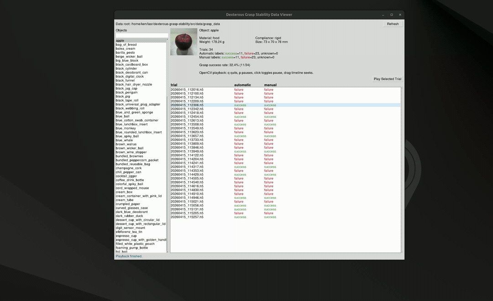

# Viewer and Resampler Scripts

This directory contains the Python code for working with the grasp dataset. The dataset itself is
distributed separately and downloaded into `data/`.

- [`data_viewer.py`](data_viewer.py) — browse and replay HDF5 grasp trials.
- [`resample.py`](resample.py) — build fixed-window, training-ready samples.

Run the commands below from this directory (`src/`).

## Download

The dataset will be available on OPARA (coming soon). The instructions below apply once it is released.

The complete raw dataset is approximately 1.2 TB and will be distributed as **20 zip archives, each containing
10 object directories**. A partial download is fully usable: a subset of the raw-data archives can be
downloaded and used on its own if 1.2 TB of storage is not available.

The data directories are already provided with `.keep` files. Downloaded data, archives, and generated
samples are excluded from Git.

Download the raw-grasp archives (`data01.zip` through `data20.zip`) into `data/grasp_data` and extract them:

```bash
unzip 'data/grasp_data/*.zip' -d data/grasp_data
```

Each archive expands to object directories directly, producing `data/grasp_data/<object_name>/<timestamp>.h5`.
Verify a complete extraction with:

```bash
find data/grasp_data -mindepth 1 -maxdepth 1 -type d | wc -l  # expected: 200
find data/grasp_data -name '*.h5' | wc -l                   # expected: 10000
```

Download `object_pictures_jpg_square.zip` into `data/` and extract it there:

```bash
unzip data/object_pictures_jpg_square.zip -d data
```

This places the reference images in `data/object_pictures_jpg_square/`, for example
`data/object_pictures_jpg_square/apple.jpg`. Object metadata is already included in `data/dataset.csv`.

## Directory Structure

After completing the steps above, this directory looks like this. Downloaded ZIP archives and `.keep` files
are omitted from the tree.

```text
.
├── README.md                                # data download, format, and tool usage
├── requirements.txt
├── data_viewer.py
├── resample.py
└── data/
    ├── LICENSE                              # dataset license
    ├── dataset.csv                          # per-object metadata and success rates
    ├── grasp_data/                          # 200 objects, 10,000 trials total
    │   ├── <object_name>/
    │   │   └── <timestamp>.h5                # one grasp trial
    │   └── ...
    ├── object_pictures_jpg_square/
    │   ├── <object_name>.jpg                 # one reference image per object
    │   └── ...
    └── resampled_grasp_data/                 # resampler output; initially empty
```

## Installation

Python 3.10 or newer. Install the dependencies into a virtual environment:

```bash
pip install -r requirements.txt
```

`torch` is required only by `resample.py` and accounts for almost all of the install size. To browse the data
with `data_viewer.py` alone, comment out its line in `requirements.txt` first.

The GUI uses `tkinter`, which is usually included with Python. On Linux, install the system Tk package if
Python cannot import `tkinter`.

## Data Viewer



Run the viewer from this directory:

```bash
python data_viewer.py
```

The GUI shows the object list on the left. Selecting an object displays its reference image and, when
`data/dataset.csv` is available, its primary and secondary materials, compliance, weight, and dimensions. It also
loads the object's HDF5 trials on the right together with automatic and manual labels. Select a trial and
click `Play Selected Trial`, or double-click the trial row.

During playback:

- `q` or closing the OpenCV window quits playback.
- `p` pauses or resumes playback.
- Clicking the video toggles pause.
- Dragging the timeline seeks through the synchronized streams.

The playback window displays a synchronized layout:

- RealSense RGB
- RealSense depth visualization
- Digit360 tactile camera frames
- Audio spectrogram and robot/sensor state overlays

The overlay includes grasp phase, object/trial name, automatic/manual labels, pressure, xArm joints and
end-effector pose, xArm force/torque, and Tilburg hand joint values when those streams are present in the
HDF5 file.

## Resampler

Build fixed-window, training-ready samples from `data/grasp_data`. The resampler is what turns the natively
asynchronous streams into synchronized, fixed-length arrays on a common time grid:

```bash
python resample.py
```

> **Caution:** with the default `CONFIG`, the resampler writes one HDF5 sample per trial and needs roughly
> **120 GB** of free disk space for the full 10,000-trial dataset (about 13 MB per sample). Set `max_trials`
> to a small number, or reduce the frame counts and image sizes in `CONFIG`, to build a smaller subset first.

The script is configured through the inline `CONFIG` dictionary near the top of `resample.py`. By default it
writes to:

```text
data/resampled_grasp_data/
```

The window can be selected either by a fixed duration from a phase start (`mode="duration"`) or by a phase
range (`mode="phase_range"`). Available phase names are `reach`, `grasp`, `lift`, and `post_lift`. In
phase-range mode, the end phase is treated as ending at the next phase start minus the configurable
`end_phase_margin_s`.

The output directory contains one HDF5 sample per trial under `samples/<object_name>/`, a `trial_index.csv`
listing every sample with its label and source trial, and a `meta.json` recording the configuration used to
build the samples.

## HDF5 Trial Format

Each trial is a single HDF5 file whose top-level group is the trial timestamp. Tabular streams are stored as
compound datasets with named columns, images and audio as encoded byte blobs, and depth as a raw array:

```text
<timestamp>/
├── grasp/
│   ├── grasp_label.csv              # method (automatic | manual), label (0 | 1)
│   ├── grasp_phases.csv             # phase, perf_time, iso_time
│   ├── grasp_positions.csv          # detected object and end-effector targets
│   ├── detect_before_grasp.jpg
│   └── detect_after_lift.jpg
├── realsense/
│   ├── rgb/{frames, rgb.csv}        # encoded JPEG frames + timestamps
│   ├── depth/{raw_mm, depth.csv}    # (N, 480, 640) uint16 millimeters + timestamps
│   ├── realsense_intrinsics.json
│   └── realsense_extrinsics.json
├── opentouch/
│   ├── opentouch.csv                # sensor-to-finger mapping and start times
│   └── digit360/{thumb,index,middle,ring}/
│       ├── camera/{frames, camera.csv}
│       ├── audio/{wav, spectrogram.jpg, chunks.csv}
│       └── serial/{imu_raw_acc, imu_raw_gyro, imu_raw_mag, imu_quat,
│                   pressure, pressure_ap}.csv
├── tilburg/                         # hand joint positions, velocities, actions
├── xarm/                            # arm joint state, end-effector pose, force/torque, actions
└── metadata/                        # collection configuration
```

All streams share a common `perf_time` clock (seconds, monotonic within a trial), which is what the phase
boundaries in `grasp_phases.csv` refer to. Use it to align streams recorded at different rates.

## License

The Python scripts are licensed under the [MIT License](../LICENSE).
The dataset and metadata are licensed separately under [CC BY-NC-ND 4.0](data/LICENSE).
